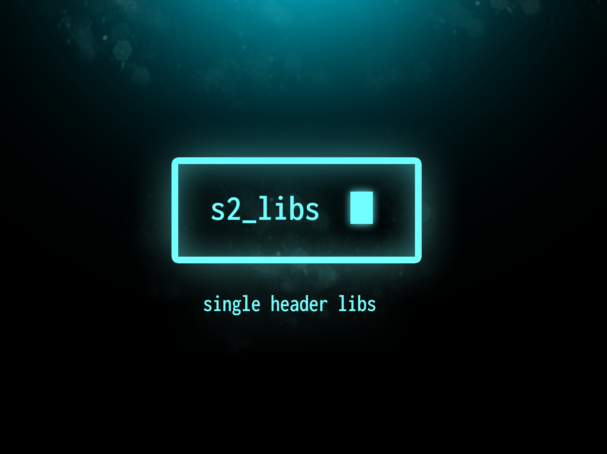

# s2_libs
single header libs, under public domain.

library    | version |  description
-----------|---------|------------
**[s2_window.h](s2_window.h)** | 1.0 | abstraction layer for generating windows.

 
